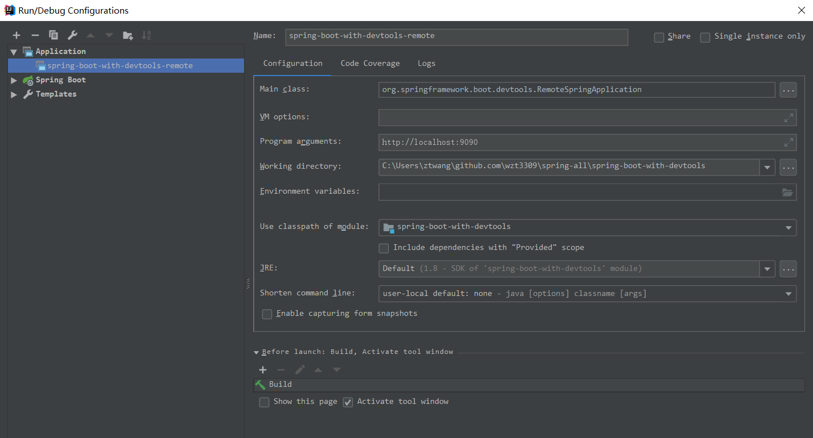

# spring-boot-with-devtools
> The content below is referenced from [Spring-boot docs - Developer Tools](https://docs.spring.io/spring-boot/docs/2.1.1.RELEASE/reference/htmlsingle/#developer-tools)

## Restart VS Reload
The restart technology provided by Spring Boot works by using two classloaders. Classes that do not change (for example, those from third-party jars) are loaded into a base classloader. Classes that you are actively developing are loaded into a restart classloader. When the application is restarted, the restart classloader is thrown away and a new one is created. This approach means that application restarts are typically much faster than “cold starts”, since the base classloader is already available and populated.

If you find that restarts are not quick enough for your applications or you encounter classloading issues, you could consider reloading technologies such as JRebel from ZeroTurnaround. These work by rewriting classes as they are loaded to make them more amenable to reloading.

## What DevTools do
Several of the libraries supported by Spring Boot use caches to improve performance. For example, template engines cache compiled templates to avoid repeatedly parsing template files. Also, Spring MVC can add HTTP caching headers to responses when serving static resources.

While caching is very beneficial in production, it can be counter-productive during development, preventing you from seeing the changes you just made in your application. For this reason, spring-boot-devtools disables the caching options by default.

Cache options are usually configured by settings in your `application.properties` file. For example, Thymeleaf offers the `spring.thymeleaf.cache` property. Rather than needing to set these properties manually, the `spring-boot-devtools` module automatically applies sensible development-time configuration.

DevTools will enable `DEBUG` logging for the web logging group. This will give you information about the incoming request, which handler is processing it, the response outcome, etc. If you wish to log all request details (including potentially sensitive information), you can turn on the `spring.http.log-request-details` configuration property.

> If you don’t want property defaults to be applied you can set `spring.devtools.add-properties` to `false` in your `application.properties`.


## Triggering a restart
As DevTools monitors classpath resources, the only way to trigger a restart is to update the classpath. The way in which you cause the classpath to be updated depends on the IDE that you are using. In Eclipse, saving a modified file causes the classpath to be updated and triggers a restart. In IntelliJ IDEA, building the project (Build -> Build Project) has the same effect.

## Which you need to notice

1. As long as forking is enabled, you can use the supported build plugins(Maven and Gradle) same as IDE(IDEA, Eclipse, STS) to start the application, since DevTools needs an isolated application classloader to operate properly. By default, Gradle and Maven do that when they detect DevTools on the classpath.

2. DevTools's automatic restart works very well when used with LiveReload. If you use JRebel, automatic restarts are disabled in favor of dynamic class reloading. Other devtools features (such as LiveReload and property overrides) can still be used.

> The spring-boot-devtools module includes an embedded LiveReload server that can be used to trigger a browser refresh when a resource is changed. LiveReload browser extensions are freely available for Chrome, Firefox and Safari from livereload.com.

3. DevTools relies on the application context’s shutdown hook to close it during a restart. It does not work correctly if you have disabled the shutdown hook (SpringApplication.setRegisterShutdownHook(false)).

> When the classpath is changed, DevTools will shutdown the application and then restart it.

4. When deciding if an entry on the classpath should trigger a restart when it changes, DevTools automatically ignores projects named spring-boot, spring-boot-devtools, spring-boot-autoconfigure, spring-boot-actuator, and spring-boot-starter.

> So don't named your project for thoes names

5. DevTools needs to customize the ResourceLoader used by the ApplicationContext. If your application provides one already, it is going to be wrapped. Direct override of the getResource method on the ApplicationContext is not supported.

## Excluding Resources
Certain resources do not necessarily need to trigger a restart when they are changed. For example, Thymeleaf templates can be edited in-place. By default, changing resources in `/META-INF/maven`, `/META-INF/resources`, `/resources`, `/static`, `/public`, or `/templates` does not trigger a restart but does trigger a live reload. If you want to customize these exclusions, you can use the spring.devtools.restart.exclude property. For example, to exclude only `/static` and `/public` you would set the following property:
```properties
spring.devtools.restart.exclude=static/**,public/**
```
> If you want to keep those defaults and add additional exclusions, use the `spring.devtools.restart.additional-exclude` property instead.

## Watching Additional Paths
You may want your application to be restarted or reloaded when you make changes to files that are not on the classpath. To do so, use the `spring.devtools.restart.additional-paths` property to configure additional paths to watch for changes. You can use the `spring.devtools.restart.exclude` property described earlier to control whether changes beneath the additional paths trigger a full restart or a live reload.


## Disable Restart
If you do not want to use the restart feature, you can disable it by using the `spring.devtools.restart.enabled` property. In most cases, you can set this property in your application.properties (doing so still initializes the restart classloader, but it does not watch for file changes).

## Using a Trigger File
To use a trigger file, set the spring.devtools.restart.trigger-file property to the path of your trigger file.

## Remote Applications
You need two endpoint, the remote endpoint(run in server) and the local endpoint(client, run in IDE), both are the same project.

To enable it, you need to make sure that devtools is included in the repackaged archive, as shown in the following listing:
```xml
<build>
	<plugins>
		<plugin>
			<groupId>org.springframework.boot</groupId>
			<artifactId>spring-boot-maven-plugin</artifactId>
			<configuration>
				<excludeDevtools>false</excludeDevtools>
			</configuration>
		</plugin>
	</plugins>
</build>
```

Then you need to set a spring.devtools.remote.secret property, as shown in the following example(this property need to add to both server and client side):
```properties
spring.devtools.remote.secret=mysecret
```

### Running the Remote Client Application
The remote client application is designed to be run from within your IDE. You need to run `org.springframework.boot.devtools.RemoteSpringApplication` with the same classpath as the remote project that you connect to. The application’s single required argument is the remote URL to which it connects.

For example, if you are using IDEA and you have a module named `spring-boot-with-devtools` that you have deployed to AWS EC2 (The example below uses the local VM), you would do the following:

- Select `Run Configurations…​` from the `Run` menu.
- Add a new `Application`.
- Select your module from `Use classpath of module`
- Use `org.springframework.boot.devtools.RemoteSpringApplication` as the main class.
- Add http://localhost:9090 to the Program arguments (or whatever your remote URL is).



A running remote client(in your IDE) might resemble the following listing:
```bash
  .   ____          _                                              __ _ _
 /\\ / ___'_ __ _ _(_)_ __  __ _          ___               _      \ \ \ \
( ( )\___ | '_ | '_| | '_ \/ _` |        | _ \___ _ __  ___| |_ ___ \ \ \ \
 \\/  ___)| |_)| | | | | || (_| []::::::[]   / -_) '  \/ _ \  _/ -_) ) ) ) )
  '  |____| .__|_| |_|_| |_\__, |        |_|_\___|_|_|_\___/\__\___|/ / / /
 =========|_|==============|___/===================================/_/_/_/
 :: Spring Boot Remote ::  (v2.1.1.RELEASE)

2018-12-04 14:11:39.590  INFO 11388 --- [           main] o.s.b.devtools.RemoteSpringApplication   : Starting RemoteSpringApplication v2.1.1.RELEASE on ZeTaoWang-PC with PID 11388 (C:\Users\ztwang\.m2\repository\org\springframework\boot\spring-boot-devtools\2.1.1.RELEASE\spring-boot-devtools-2.1.1.RELEASE.jar started by ztwang in C:\Users\ztwang\github.com\wzt3309\spring-all\spring-boot-with-devtools)
2018-12-04 14:11:39.593  INFO 11388 --- [           main] o.s.b.devtools.RemoteSpringApplication   : No active profile set, falling back to default profiles: default
2018-12-04 14:11:39.911  WARN 11388 --- [           main] o.s.b.d.r.c.RemoteClientConfiguration    : The connection to http://localhost:9090 is insecure. You should use a URL starting with 'https://'.
2018-12-04 14:11:39.973  INFO 11388 --- [           main] o.s.b.d.a.OptionalLiveReloadServer       : LiveReload server is running on port 35729
2018-12-04 14:11:39.983  INFO 11388 --- [           main] o.s.b.devtools.RemoteSpringApplication   : Started RemoteSpringApplication in 0.715 seconds (JVM running for 1.324)
2018-12-04 14:12:26.019  INFO 11388 --- [   File Watcher] o.s.b.d.r.c.ClassPathChangeUploader      : Uploaded 5 class resources
2018-12-04 14:12:28.275  INFO 11388 --- [pool-1-thread-1] o.s.b.d.r.c.DelayedLiveReloadTrigger     : Remote server has changed, triggering LiveReload

```

> Because the remote client(in your IDE) is using the same classpath as the real application it can directly read application properties. This is how the `spring.devtools.remote.secret` property is read and passed to the server for authentication.

> It is always advisable to use https:// as the connection protocol, so that traffic is encrypted and passwords cannot be intercepted.

> If you need to use a proxy to access the remote application, configure the `spring.devtools.remote.proxy.host`and `spring.devtools.remote.proxy.port` properties.

### Remote Update
The remote client(in your IDE) monitors your application classpath for changes in the same way as the local restart. Any updated resource is pushed to the remote application and (if required) triggers a restart. This can be helpful if you iterate on a feature that uses a cloud service that you do not have locally. Generally, remote updates and restarts are much quicker than a full rebuild and deploy cycle.

> Files are only monitored when the remote client is running. If you change a file before starting the remote client, it is not pushed to the remote server.